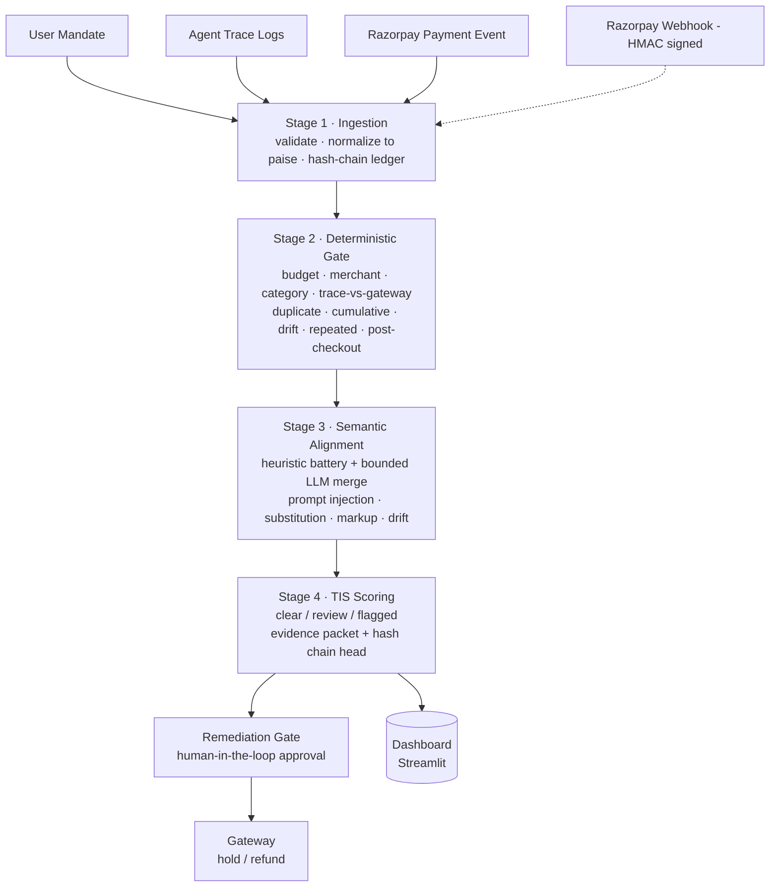

# Project Sentinel

**Agentic Payment Incident & Evidence Intelligence**

The payment rail can prove money moved. Sentinel proves whether an autonomous AI agent moved it **for the right reason, within the right authority** — and builds a tamper-evident evidence package the moment it didn't.


---

## The problem

Autonomous shopping/procurement agents can now search, select, and pay on a user's behalf. Payment rails verify that a transaction was *authorized* — but nothing verifies that the agent stayed *faithful to the user's delegated intent* while getting there. Prompt injection, merchant redirects, silent product substitution, and policy drift all look identical to a "successful payment" from the rail's point of view.

Sentinel is a **post-transaction auditor** that sits outside the agent, ingests three independent streams per session, and cross-verifies them so deviation can never be hidden behind a single trusted source:

| Stream | Source | Trust level |
|---|---|---|
| User mandate | App at delegation time | **Authoritative intent** |
| Agent trace logs | The agent's self-reported actions | **Untrusted** |
| Razorpay payment event | The gateway (signed) | **Ground truth** |

> Deviations are detected by cross-verifying the untrusted trace against the signed gateway payload and the mandate — never by believing either alone.

---

## Pipeline



**Rule:** hard, money-moving verdicts come only from deterministic, reproducible rules. The LLM (Stage 3) can *add* findings but can never soften, clear, or re-score anything — the **one-way valve**.

| Stage | Engine | Role |
|---|---|---|
| 1. Ingestion | FastAPI + Pydantic | Validates at the edge (422s, never 500s), normalizes money to int paise, persists idempotently, appends to a hash-chained ledger |
| 2. Deterministic gate | Pure Python, zero LLM | 10-rule constraint battery; gateway payload always breaks ties over the trace |
| 3. Semantic alignment | Heuristic battery, optional LLM | Detects prompt injection, product substitution, price markup, semantic drift |
| 4. Dispute & evidence | TIS scorer + packet builder | Severity-weighted score → status; signed, tamper-evident evidence packet; suggested remediation |

---

## Trust invariants

1. **Ground truth beats claims** — signed gateway payload + mandate outrank the agent trace in every conflict.
2. **No floats in evidence** — money is int paise everywhere; the hash chain rejects floats.
3. **One-way valve** — the LLM can only make a verdict stricter, never clearer; merged findings ⊇ heuristic findings; LLM-only findings cap at MINOR severity.
4. **History is never rewritten** — the ledger is append-only; re-evaluation adds, never edits.
5. **No side effect without a human** — gateway actions require an approved, atomically-claimed remediation request.
6. **Money is capped everywhere** — cumulative refunds ≤ payment amount in every gateway mode; requests capped at 1 crore / 1 MB / 300 req per 60s.
7. **Fail closed, fail loud** — no API key → refuse to start; no webhook secret → webhook disabled; bad signature → 400; misconfig fallback → logged CRITICAL.
8. **Every finding is grounded** — each finding carries an `evidence_ref`; each score carries its full derivation.

---

## Scoring — Transaction Integrity Score (TIS)

TIS blends two independently-computed sub-scores: a deterministic score from Stage 2 (hard, reproducible rules) and a semantic score from Stage 3 (heuristic battery, optionally LLM-augmented). The deterministic side always dominates the weighting, and either an explicit override or a low blended score can send a transaction to `flagged`.

```
s_det = max(0, 1 − Σ penalty(constraint))    # deduped per constraint, worst breach kept
s_sem = semantic alignment score              # 1 − Σ finding-penalty, from Stage 3

TIS   = round(100 × (0.6·s_det + 0.4·s_sem), 1)
```

**Per-constraint penalty table** (Stage 2, deterministic):

| Constraint | Severity | Penalty |
|---|---|---|
| `budget` / `cumulative_budget` | hard | 0.30 + 0.20 × min(1, breach_ratio) |
| `merchant` | hard | 0.50 |
| `trace_gateway` (trace vs. gateway mismatch) | hard | 0.40 |
| `duplicate_payment` | hard | 0.40 |
| `merchant_drift` | hard | 0.35 |
| `repeated_action` | soft | 0.15 |
| `category` | soft | 0.10 |
| `time_window` | soft | 0.10 |
| `post_checkout` | soft | 0.10 |
| (unknown constraint) | — | 0.10 |

`breach_ratio` for budget checks is `(settled − budget) / budget`, so the penalty scales with how far over the line the settlement went rather than treating every breach the same. Checks are deduplicated per constraint across payment- and step-level rows, keeping only the worst (max) breach ratio — so one constraint can't be penalized twice for the same underlying problem.

**Semantic penalty table** (Stage 3, same table for both mock and LLM-merged mode):

| Finding | Severity | Penalty |
|---|---|---|
| `PROMPT_INJECTION` | CRITICAL | 0.35 |
| `PRODUCT_SUBSTITUTION` | MAJOR | 0.30 |
| `SEMANTIC_DRIFT` | MINOR | 0.30 |
| `PRICE_MARKUP` | MAJOR | 0.20 |

`s_sem = 1 − min(1, Σ these penalties)`. When the LLM is enabled it can only ever *add* to this finding set (never remove or downgrade one the heuristic battery already found), and any LLM-only finding with no heuristic corroboration is capped at MINOR — so a compromised or jailbroken LLM auditor can at worst push a transaction into `review`, never clear one that should be `flagged`.

**Status derivation:**

```
status = flagged   if ANY hard-constraint failure OR ANY CRITICAL finding   (hard override)
       = flagged   elif TIS < 60   (flagged_max_tis)
       = review    elif TIS < 90   (clear_min_tis)
       = clear     otherwise
```

The hard override exists so a clean-looking blended score can't mask a single disqualifying fact — e.g. a prompt injection with otherwise clean constraints must not sit indefinitely in "review."

Every derivation — which constraints fired, their breach ratios, the exact penalties applied, the weights used, and whether the hard override triggered — is stored in `scores.derivation` and rendered in full in every evidence export. Nothing about the score is a black box.

> Note: this replaces an earlier binary formula from the original architecture proposal (`S_det ∈ {0,1}`, no breach-ratio scaling, no per-constraint weighting) with the severity-weighted version above, arrived at after the audit rounds.

---

## Tech stack

| Concern | Choice | Why |
|---|---|---|
| Backend | FastAPI + Pydantic v2 | Async, typed, free OpenAPI docs |
| Database | SQLAlchemy — SQLite (dev) / PostgreSQL (prod via `DATABASE_URL`) | Zero external services for the demo, drop-in swap for production |
| LLM |  Ollama-native endpoint | Bounded, single call, strict JSON contract, deterministic `mock` fallback |
| Payments | Razorpay test mode + mock/emulated gateway | Real test-mode payment and webhook for the demo; enforces provider invariants (refund caps, TOCTOU-safe) in every mode |
| Dashboard | Streamlit | Fast timeline-replay UI; renders all untrusted content as plain text |
| Tests | pytest | 354 checks across 10 suites, green on SQLite and PostgreSQL |

---

## Security highlights

- Request path: rate limit → body-size cap → API-key check → route (webhook is the sole unauthenticated route, verified instead by HMAC-SHA256 over the raw body).
- Append-only, hash-chained evidence ledger with exact-row tamper localization.
- Every evidence export is HMAC-signed and independently re-verifiable.
- Global error handler never leaks internals; all attacker-influenced log values are sanitized against log injection.

See the full [architecture doc](./project-sentinel-architecture.txt) for the constraint battery, findings taxonomy, gateway strategy, remediation state machine, and the complete threat-model table.

---

## Repository layout

```
sentinel/
├── main.py, config.py, database.py, security.py
├── api/routes/       # telemetry · incidents · remediation · webhook · export
├── engines/           # deterministic · semantic · llm · scoring · evidence
├── services/          # pipeline · integrity (hash chain) · razorpay_client · webhook_verify
├── models/            # SQLAlchemy: telemetry · incident · ledger · webhook registry
├── schemas/           # ingest contract, evidence shape
├── dashboard/         # Streamlit app + defensive HTTP client
├── tools/             # emulated Razorpay, seed batch, LLM smoke test
├── data/config/       # policy.json, merchant_registry.json
├── data/seeds/batch/  # 20 scenario payloads + manifest
└── tests/             # 10 suites, 354 checks
```

---

## Run it

```bash
export API_KEY=…
python3 -m venv .venv && .venv/bin/pip install -r requirements.txt
.venv/bin/pytest -q                                  # test suite
.venv/bin/uvicorn sentinel.main:app --port 8000       # API
streamlit run sentinel/dashboard/app.py               # dashboard
python3 sentinel/tools/seed_batch.py --base … --key … # 20-scenario E2E seed
```

## Status

**Slice 1 (Evidence Engine): complete** — 4-stage pipeline, hash-chained ledger, TIS scoring, signed evidence export, gateway with mock/live strategies, human-in-the-loop remediation, webhook receiver. 354 tests green on SQLite and PostgreSQL across three audit rounds.

**Repository policy:** local-only — no remote push, all work stays on-machine.

---

## Strategy — why this problem

An earlier direction (an AI cash-flow/finance-controller idea) was scrapped after validation showed Razorpay's own 2026 product surface (Cashflow Forecaster, Insights Agent, RAY co-pilot, Payout/Receivables/Bookkeeping Agents) already covers that ground critically. The pivot to **agentic payment incident & evidence intelligence** targets a gap that's real but not yet owned:

- Payment rails and emerging trust protocols (Mastercard Verifiable Intent, Experian Agent Trust, FIDO agentic auth) prove a transaction was *authorized* — not that the agent stayed faithful to delegated intent.
- Post-transaction accountability, dispute evidence, and remediation for *agent-caused* incidents remain fragmented and early.
- The build is technically deep enough to demonstrate real engineering (deterministic + semantic + cryptographic layers) rather than an LLM chat wrapper.
